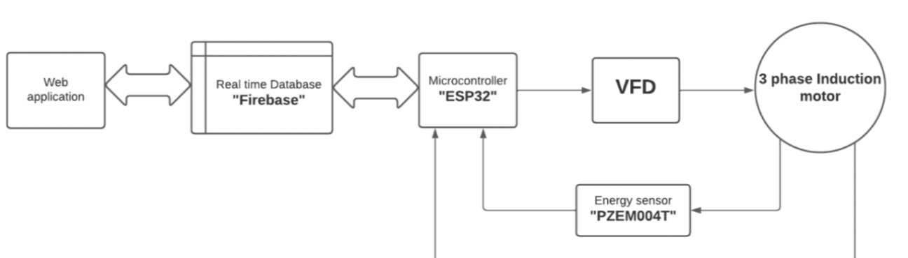

The repository contains all files associated with the final year project - Smart control of Induction motor using Web application.

The project uses an ESP32 microcontroller to control a VFD (Variable Frequency drive) which controls the speed, direction, and start/stop of the induction motor.
The project also incorporates a PZEM004t AC power meter sensor which can measure AC voltage, current, Power, Frequency, Power factor, and energy which can then be 
pushed to the Real-time database to be displayed to the user and used for fault detection and debugging as well as raising custom alerts in case of fault conditions.

<strong>Block Diagram</strong>.

The electronics hardware is structured as shown below

The repository has 2 parts:
  1. Firmware files (Arduino code running on ESP32)
  2. Web application files (Code for frontend user interface and backend server interaction)

