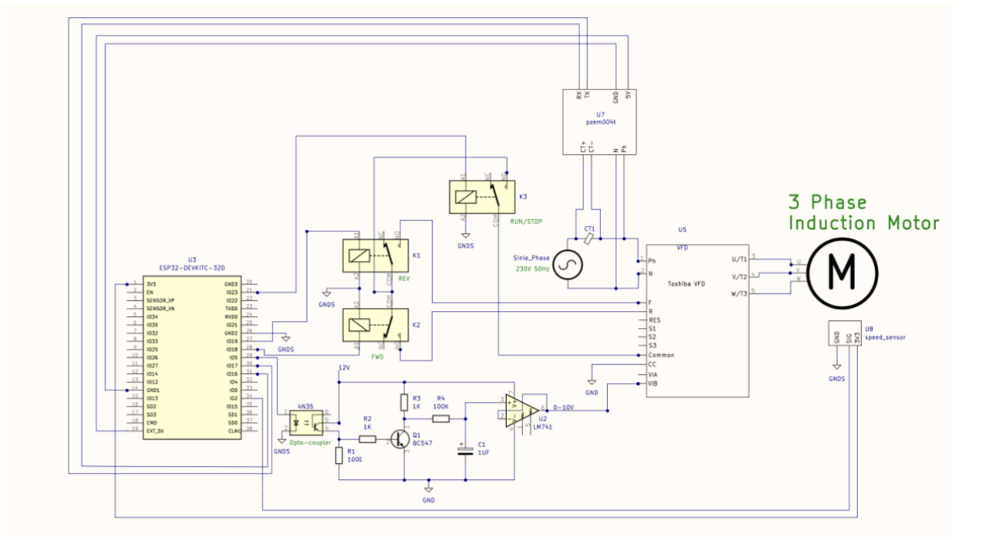
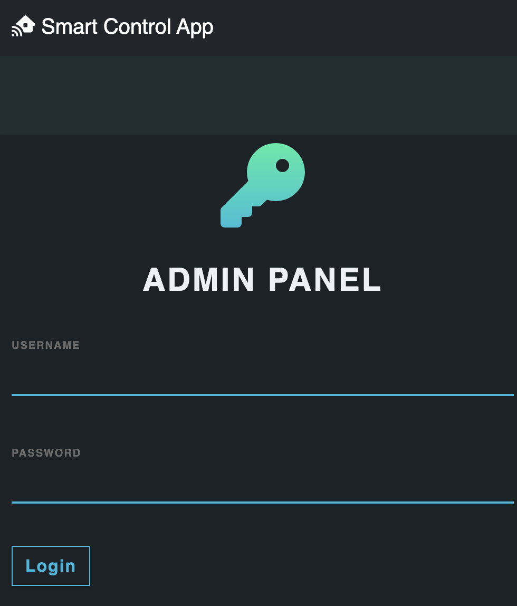
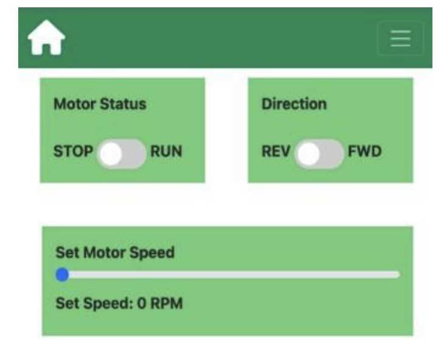
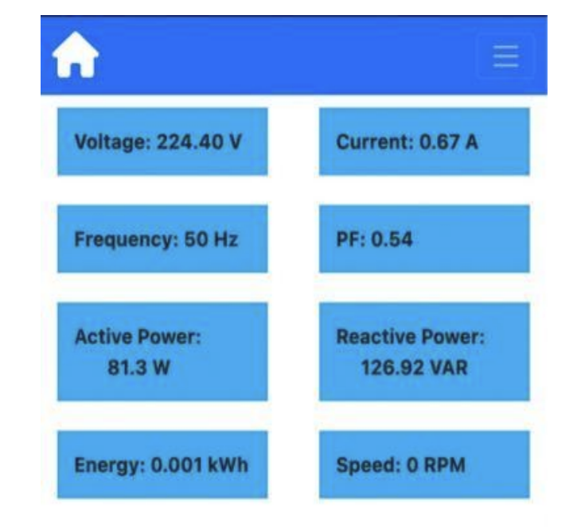

The repository contains all files associated with the final year project - Smart control of Induction motor using Web application.

The project uses an ESP32 microcontroller to control a VFD (Variable Frequency drive) which controls the speed, direction, and start/stop of the induction motor.
The project also incorporates a PZEM004t AC power meter sensor which can measure AC voltage, current, Power, Frequency, Power factor, and energy which can then be 
pushed to the Real-time database to be displayed to the user and used for fault detection and debugging as well as raising custom alerts in case of fault conditions.

<strong>Block Diagram</strong>.

<strong>The electronics hardware is structured as shown below<strong/>

The repository has 2 parts:
  1. Firmware files (Arduino code running on ESP32)
  2. Web application files (Code for frontend user interface and backend server interaction)

The firmware running on esp32 does 2 things
  1. Pull the latest speed and status data from the real-time database and adjust VFD according to the data received from the database.
  2. Push electrical data from PZEM004t to the server to be displayed on the web application.

The web application interacts with the user and database.

Web application has 3 parts:
  1. Login page
  2. Control panel
  3. Dashboard

<strong>login Page</strong>

<strong>Control Panel</strong>

<strong>Dashboard</strong>

